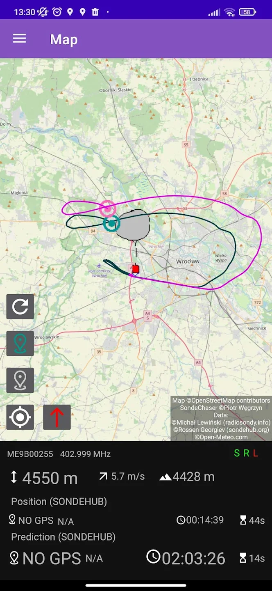
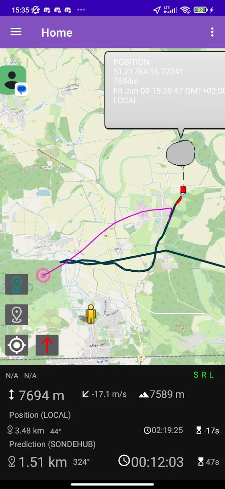
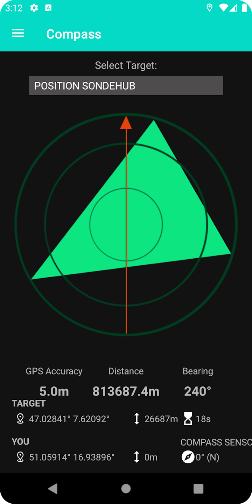

# Sondechaser app

Sondechaser is a **Radiosonde** tracking app, to help you follow Sondes in terrain.

## Features

Sondechaser is an app that visualizes data from three sources:
* [radiosondy.info](https://radiosondy.info/)
* [sondehub.org](https://sondehub.org/)
* and your local tracker device

Sonde tracks and predicted landing points are displayed on a map from all three sources at the same time!

All the useful data (like altitude, landing time, or distance) is presented on the same screen as the map.

Alternatively compass view is available.

Sondechaser works well in weak internet conditions.

The following local tracker devices are supported (local radio receivers with decoders):
* rdz_ttgo_sonde - on TTGO board (via IP)
* MySondy GO - on TTGO board (via Bluetooth)
* any *custom* decoder (for example on Raspberry Pi) with json HTTP server endpoint (via IP, json format in manual)

## Screenshots

|  |  |  |
| ---------------------------------------------- | -------------------------------------------- | ------------------------------------------- |

## Installation & Support

You can get APK file for manual installation from the [releases](https://github.com/piotro888/sondechaser/releases/) page.

Or if you like my work, you can **support me** by buying the app on [Google Play](https://play.google.com/store/apps/details?id=eu.piotro.sondechaser.paid) ❤️

## Contributing

Feel free to report issues or open a pull request!

## Atribution

Creating this project would not be possible without:
* OpenStreetMap - great maps
* radiosondy.info - providing sonde data
* sondehub.com - providing sonde data
* Open-Meteo - elevation data

Thanks!

You can contribute to the global Radiosonde tracking network, by setting up your own radio receiver to one of those services. My app is only a frontend displaying data from these sources.

## Manual & Changelog

CHANGELOG can be found [here](https://github.com/piotro888/sondechaser/blob/master/CHANGELOG)

The manual is present inside the app or you can view the [source](https://github.com/piotro888/sondechaser/blob/master/app/src/main/assets/guide/index.html)

## License

Sondechaser is fully Open Source!

Licensed under [MIT License](https://github.com/piotro888/sondechaser/blob/master/LICENSE). 